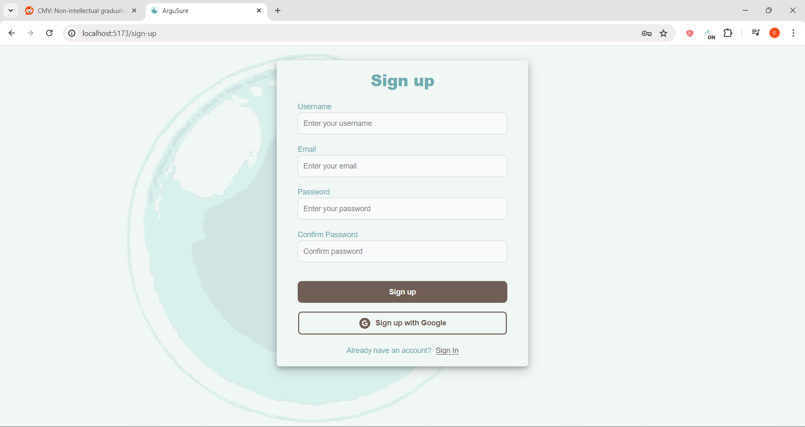
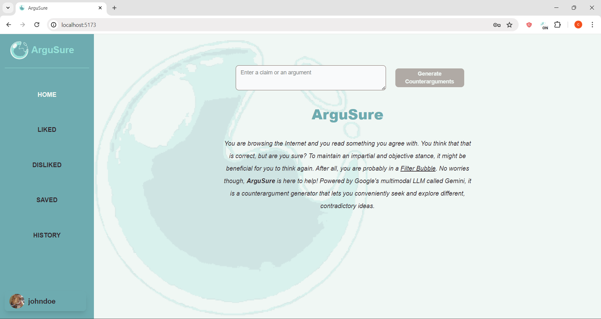
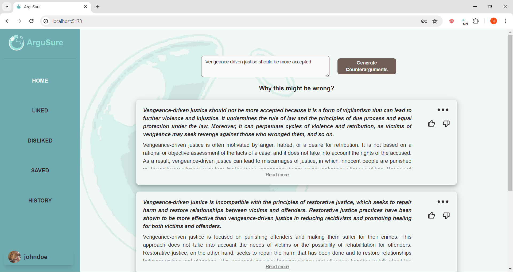
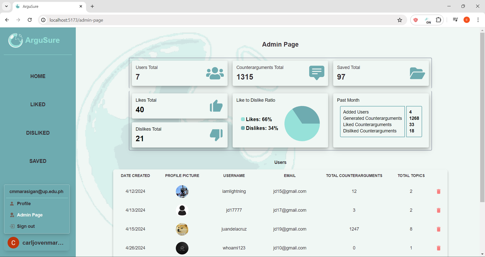

# Web Application for ArguSure

ArguSure is a Gemini-base Chrome Extension for Counterargument Generation. This web application is for users to view and organize their generated counterarguments, and for admins to view and organize application data/statistics and users.

For more info, please see [this repository](https://github.com/cj-mm/ArguSure).

### Sample screenshots:

#### Signup Page

#### Homepage

#### Homepage with Counterarguments

#### Admin Page

