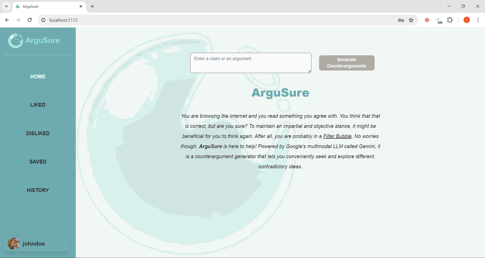
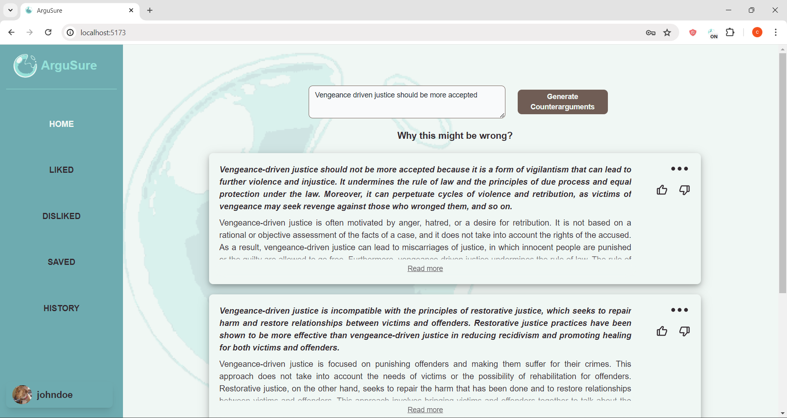
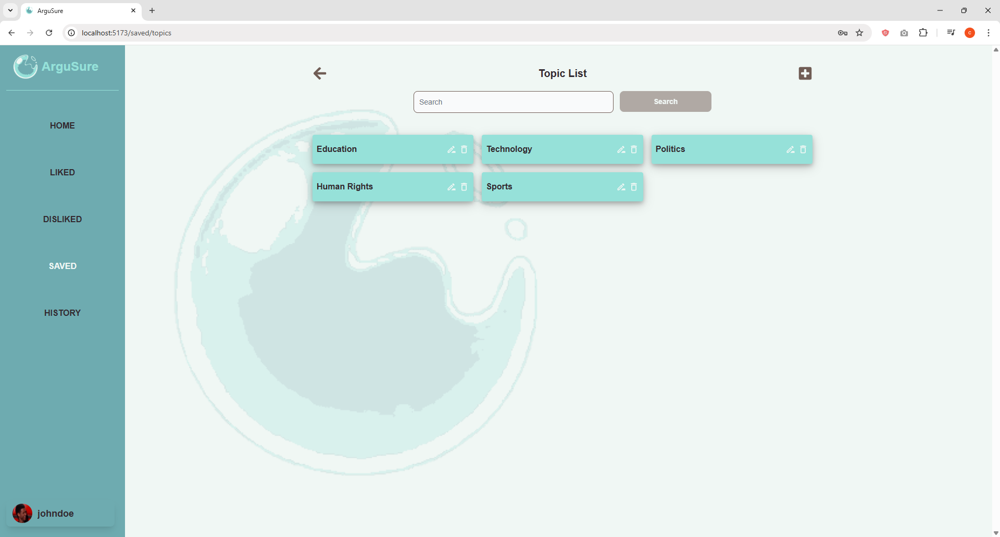
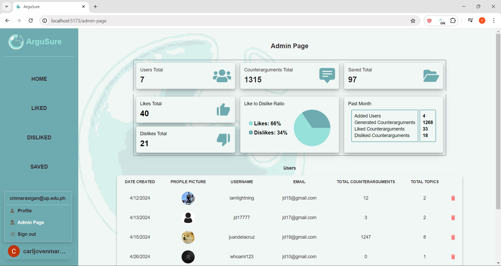

<div align="center">
  
  <h1>ArguSure</h1>
</div>

<!-- > ⚠️ **Note:** The live demo is hosted on Render's free tier. The server may take **~30 seconds** to wake up on the first request after a period of inactivity. If the page doesn't load immediately, just wait a moment and refresh. -->

## 📖 About

**ArguSure** is a Gemini-based Chrome Extension for Counterargument Generation. This repository is for it's corresponding full-stack web application developed for users to view and organize their generated counterarguments and for admins to view and manage application data and statistics. The goal is to help users confront contradictory perspectives, challenge their own assumptions, and escape the "filter bubbles" created by algorithm-driven content feeds.

Users submit a claim or argument, and ArguSure runs it through a **multi-step AI pipeline** — first validating that it's an arguable claim, then categorizing it, then generating three well-structured counterarguments, each with a summary, a detailed body, and cited sources.

For more info, please see [this repository](https://github.com/cj-mm/ArguSure).

---

## ✨ Features

- **AI-Powered Counterargument Generation** — Multi-step Gemini pipeline that validates, categorizes, and generates three structured counterarguments per claim
- **User Authentication** — Sign up and sign in with email/password or Google OAuth
- **Counterargument History** — All generated counterarguments are saved and viewable in a personal history feed
- **Like / Dislike System** — React to counterarguments and filter your saved interactions
- **Saved Topics** — Organize counterarguments into custom-named topic collections
- **Profile Management** — Update username, password, and profile picture
- **Admin Dashboard** — View platform statistics and manage user data
- **Responsive Design** — Works on desktop and mobile

---

## 🖼️ Screenshots

### Homepage



### Counterargument Generation



### Saved Topics



### Admin Dashboard



---

## 🛠️ Tech Stack

| Layer          | Technology                                                               |
| -------------- | ------------------------------------------------------------------------ |
| Frontend       | React (Vite), Tailwind CSS, Flowbite React, Redux Toolkit, Redux Persist |
| Backend        | Node.js, Express                                                         |
| Database       | MongoDB (Mongoose)                                                       |
| AI             | Google Gemini API (`gemini-1.5-flash`)                                   |
| Authentication | JWT (httpOnly cookies), Google OAuth (`@react-oauth/google`)             |
| Image Storage  | Cloudinary                                                               |

---

## 🚀 Running Locally

### Prerequisites

- Node.js (v18 or higher recommended)
- A [MongoDB Atlas](https://cloud.mongodb.com) account and cluster
- A [Google AI Studio](https://aistudio.google.com/app/apikey) Gemini API key
- A [Google Cloud Console](https://console.cloud.google.com) project with OAuth 2.0 credentials (for Google Sign-In)
- A [Cloudinary](https://cloudinary.com) account (for image uploads)

### 1. Clone the repository

```bash
git clone https://github.com/cj-mm/ArguSure.git
cd ArguSure
```

### 2. Install dependencies

```bash
# Install backend dependencies
npm install

# Install frontend dependencies
cd client && npm install && cd ..
```

### 3. Configure environment variables

Create a `.env` file in the **project root**:

```env
MONGO=mongodb+srv://<username>:<password>@<cluster>.mongodb.net/<dbname>?retryWrites=true&w=majority
JWT_SECRET=your_jwt_secret_here
PORT=5000
```

Create a `client/.env` file:

```env
VITE_GEMINI_API_KEY=your_gemini_api_key
VITE_GOOGLE_CLIENT_ID=your_google_client_id
VITE_CLOUDINARY_CLOUD_NAME=your_cloudinary_cloud_name
VITE_CLOUDINARY_UPLOAD_PRESET=your_cloudinary_upload_preset
VITE_APP_BASE_URL=http://localhost:5173
```

### 4. Run the development server

Run this in both api and client:

```bash
npm run dev
```

The backend runs on `http://localhost:5000` and the frontend on `http://localhost:5173`.

---

<div align="center">
  <p>Built by <a href="https://github.com/cj-mm">cj-mm</a></p>
</div>
